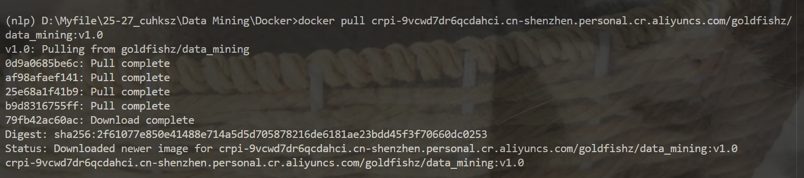

# Project Instructions

## 1) Docker Image

### Image URL

```shell
crpi-9vcwd7dr6qcdahci.cn-shenzhen.personal.cr.aliyuncs.com/goldfishz/data_mining:v1.0
```

### Pull & run Command

To pull the Docker image, use the following command:

```shell
# on win
docker pull crpi-9vcwd7dr6qcdahci.cn-shenzhen.personal.cr.aliyuncs.com/goldfishz/data_mining:v1.0
docker run -p 5724:5724 crpi-9vcwd7dr6qcdahci.cn-shenzhen.personal.cr.aliyuncs.com/goldfishz/data_mining:v1.0

# on macos without native amd64 support, so pull and run with "Use Rosetta for x86/amd64 emulation on Apple Silicon"
docker pull --platform linux/amd64 crpi-9vcwd7dr6qcdahci.cn-shenzhen.personal.cr.aliyuncs.com/goldfishz/data_mining:v1.0
docker run --platform linux/amd64 -p 5724:5724 crpi-9vcwd7dr6qcdahci.cn-shenzhen.personal.cr.aliyuncs.com/goldfishz/data_mining:v1.0
```



## 2) How to Test

### API Endpoints

#### Sentiment Analysis

- **Endpoint**: `/predict_sentiment`
- **Method**: POST
- **Input**: `news_text` (string)
- **Output**: JSON string

  ```json
  {
    "sentiment": "-1",
    "probability": "0.98"
  }
  ```

  - `sentiment`: Sentiment label (-1 = negative, 1 = positive)
  - `probability`: Confidence score for the prediction

#### Topic Classification

- **Endpoint**: `/predict_topic`
- **Method**: POST
- **Input**: `news_text` (string)
- **Output**: JSON string

  ```json
  {
    "topic": "12",
    "probability": "0.63"
  }
  ```

  - `topic`: Topic label (1-18)
  - `probability`: Confidence score for the prediction

### Send a Request

Use a client (e.g., Postman or run command in cmd) to send a request that includes a "news_text" field. Or you can refer to our test code in [`test_app.py`](./test_app.py)

Example using curl:

```bash
# on win
curl -X POST http://localhost:5724/predict_sentiment -H "Content-Type: application/json" -d "{\"news_text\": \"Company reports strong quarterly earnings"\"}"

# on macos
curl -X POST http://localhost:5724/predict_sentiment -H 'Content-Type: application/json' -d '{"news_text": "Company reports strong quarterly earnings"}'
```

### Running Container

The following image shows the container in its running state.


## 3) Results Deliveries

- 5-fold CV Weighted F1-scores on Training Data

  - **Sentiment Analysis**: 0.8024127741384737 (standard deviation: 0.015061383790324021)

  - **Topic Classification**: 0.982653106555011 (standard deviation: 0.001730632240072608)

## 4) Code Structure

```
.
├── app.py                      # Main application file
├── dockerfile                  # Docker configuration for containerization
├── readme.md                   # Project documentation (this file)
├── requirements.txt            # Python dependencies
├── subtask_1_model             # Sentiment analysis model
│   └── subtask_1_model
│       ├── F1-score.jpg        # Model performance visualization
│       ├── model.joblib        # Trained sentiment analysis model
│       └── subtask_1_model.py  # Model implementation
├── subtask_2_model             # Topic classification model
│   └── topic_model
│       └── Proj                # Topic model implementation
├── test_app.py                 # Application tests
├── test_cross_validation.json  # Cross-validation results
└── test_cross_validation.py    # Cross-validation test script
```

## 5) Components

1. **app.py**: The main entry point of the application, likely handling API endpoints or user interactions.

2. **dockerfile**: Contains instructions for building a Docker image to run the application in a containerized environment.

3. **requirements.txt**: Lists all Python libraries and dependencies required to run the project.

4. **subtask_1_model/**: Houses the sentiment analysis model implementation, including:

   - Trained model file (`model.joblib`)
   - Model source code (`subtask_1_model.py`)
   - Performance visualization (`F1-score.jpg`)

5. **subtask_2_model/**: Contains the topic classification model implementation in the `topic_model/Proj` directory.

6. **test_app.py**: Tests for the main application functionality.

7. **test_cross_validation.json**: JSON file containing cross-validation results for both models.

8. **test_cross_validation.py**: Script used to perform cross-validation testing.

## 6) Usage

To run the application, refer to the Docker instructions or install dependencies from `requirements.txt` and execute `app.py`.

To run the tests, execute the appropriate test script:

- `python test_app.py` for application tests
- `python test_cross_validation.py` for cross-validation tests
